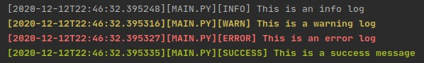

# Python Logger
Python logger for color encoded logs based on Scott Punshon's logger.js.

Colors are based on message severity


## Usage
```python
from logger import Logger
import os

log = Logger(os.path.basename(__file__))
log.info("This is an info log")
log.warn("This is a warning log")
log.error("This is an error log")
log.success("This is a success message")

``` 
You may also indent logs by specifying `indent={int}`. This, by default is set to `0`
```python
log.info("This message will be indented", indent=1)
```
`>> [2021-03-09T13:02:05.718260][MAIN.PY][INFO] 			This message will be indented`

You can also specify the indent character using `indent_char`:
```python
log = Logger(os.path.basename(__file__), indent_char=".")
log.info("This message will be indented", indent=5)
```
`>> [2021-03-09T12:56:23.943033][MAIN.PY][SUCCESS] .....This message will be indented`
